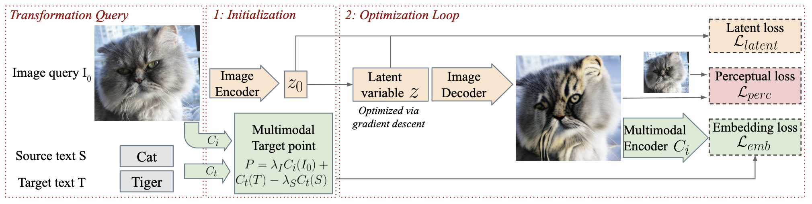

<div align="center">

# Semantic Image Translation

[](https://arxiv.org/abs/2203.04705)

    
</div>

This repository contains a benchmark for evaluating the task of Semantic Image Translation, where the goal is to edit an input image with a text transformation query (like *cat* -> *dog*).


The benchmark is presented in [FlexIT: Towards Flexible Semantic Image Translation](https://arxiv.org/abs/2203.04705) by Guillaume Couairon, Asya Grechka, Jakob Verbeek, Holger Schwenk and Matthieu Cord, CVPR 2022.

**Abstract:** *Deep generative models, like GANs, have considerably improved the state of the art in image synthesis, and are  able to generate near photo-realistic images in structured domains such as human faces. Based on this success, recent work on image editing proceeds by projecting images to the GAN latent space and manipulating the latent vector. However, these approaches are limited in that only images from a narrow domain can be transformed, and  with only a limited number of editing operations. We propose FlexIT, a novel method which can take any input image and a user-defined text instruction for editing. Our method achieves flexible and natural editing, pushing the limits of semantic image translation. First, FlexIT combines the input image and text into a single target point in the CLIP multimodal embedding space. Via the latent space of an  autoencoder, we iteratively transform the input image toward the target point, ensuring coherence and quality with a variety of novel regularization terms. We propose an evaluation protocol for semantic image translation, and thoroughly evaluate our method on ImageNet. Code will be made publicly available.*


# Benchmark


The different editing methods are compared using the following metrics: 
- LPIPS, which is a distance metric in terms of deep features between original image and edited image;
- Accuracy, which is the detection accuracy of a DeiT classifier;
- SFID, which is a simplified FID score between the generated images and the reference ImageNet (train) distribution;
- CSFID, which is a classwise SFID score.

<center>

| Method   | LPIPS | Accuracy(%) | CSFID | SFID | Runtime |
| ------   |:-----:|:-----------:|:-----:|:----:|:-------:|
| COPY     | 0.0   | 0.4         |  106.0| 0.20 |  ~0s    |
| RETRIEVE | 72.4  | 90.6        | 27.2  | 0.23 |  ~0s    |
| ManiGAN  | 21.7  | 2.0         | 123.8 | 17.0 |  ~1s    |
| StyleCLIP (\*)|33.4| 8.0       | 146.6 | 35.8 |  N/A    |
| FlexIT (3 CLIP networks, 32 steps) | 22.0 | 45.2 | 63.3 | 6.5 | 15s |
| FlexIT (3 CLIP networks, 160 steps) | 24.7 | 59.0 | 57.9 | 6.8 | 75s |
| FlexIT (5 CLIP networks, 32 steps) | 22.0 | 44.0 | 62.8 | 6.0 | 15s |
| FlexIT (5 CLIP networks, 160 steps) | 25.5 | 67.0 | 52.0 | 5.6 | 70s |

</center>
    
Runtime is computed for a single image on a 16GB Quadro GP100 GPU. With 5 networks, we use only one data augmentation per network. 
Please see the paper for further details.

*(\*) using ImageNet-pretrained StyleGAN at [https://github.com/justinpinkney/awesome-pretrained-stylegan2#Imagenet]*


# FlexIT

This repository contains the code for running the [FlexIT](https://arxiv.org/abs/2203.04705) algorithm. First, FlexIT combines the input image and text into a single target point in the CLIP multimodal embedding space. Via the latent space of an autoencoder, we iteratively transform the input image toward the target point, ensuring coherence and quality with a variety of regularization terms.




## Installation

First, get a conda environment with python >=3.6 and install dependencies.
Run installation script which installs the repository and the VQGAN encoder/decoder model.

```bash
bash install.sh
```

Then, modify the file global.yaml to include the path of your ImageNet validation dataset. 
The ImageNet folder should contain the 1000 class folders.

## Evaluation

Evaluation is a two-stage process:
The first step is to edit each dataset image according to the benchmark transformation:


```
python transform_dataset.py --config exp_configs/final.yaml \
                            --output generated/default \
                            --domain test \
```

This creates a folder `generated/default` in which edited images are saved. With FlexIT, images are created in subfolders named after the number of iterations.


Then evaluate for instance after 160 steps with 

```
python eval.py generated/default/images/160 \
```


# Creating a novel editing method

To create and evaluate a novel method for Semantic Image Translation, you should create a class Editer with the following format:

```python
class Editer:
    
    def __init__(self, *args, **kwargs):
        pass
    
    def __call__(self, img: PIL.Image, src: str, tgt:str):
        # your code to edit images here.
        # it should return a PIL image
        # it can also return a dict where values are PIL images: 
        # in that case, a key: value entry will be saved on disk in the subfolder named key.
        return img
```

then you can reference it in a config file `exp_configs/novel.yaml` with 

```yaml
editer.__class__ = path.to.Editer
editer.arg1 = args1
...
```

You can run the evaluation protocol using 

```python
python transform_dataset.py --config exp_configs/novel.yaml \
                            --output generated/novel \
                            --test # disable to run on dev set
python eval.py generated/novel
```

# License
This repository is released under the MIT license as found in the [LICENSE](LICENSE) file.

# Citation

If you are using FlexIT or this benchmark for any means, please cite us! Thanks :)

```
@inproceedings{flexit2021,
  title     = {{FlexIT}: Towards Flexible Semantic Image Translation},
  author    = {Couairon, Guillaume and Grechka, Asya and Verbeek, Jakob and Schwenk, Holger and Cord, Matthieu},
  booktitle = {Proceedings of the IEEE Conference on Computer Vision and Pattern Recognition (CVPR)},
  year      = {2022}
}
```
